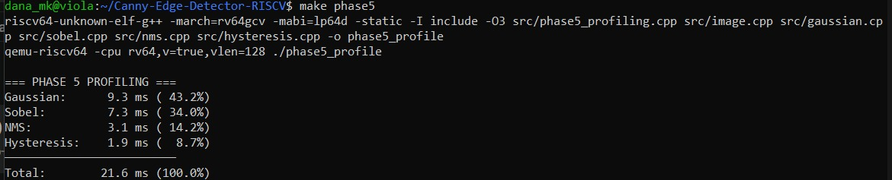
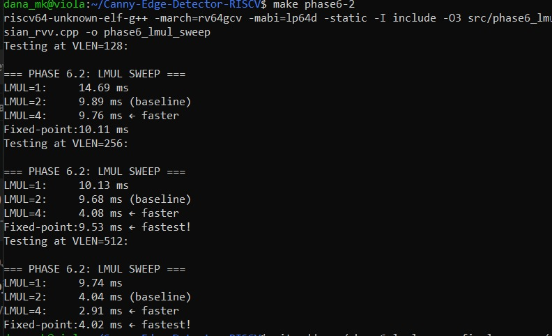
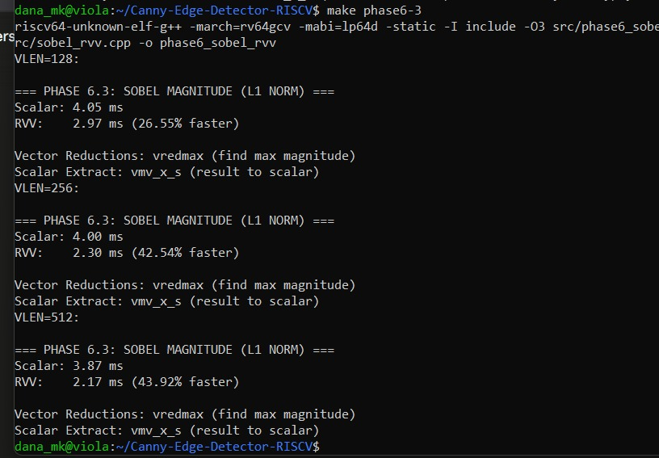
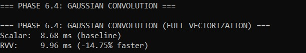
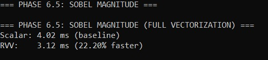
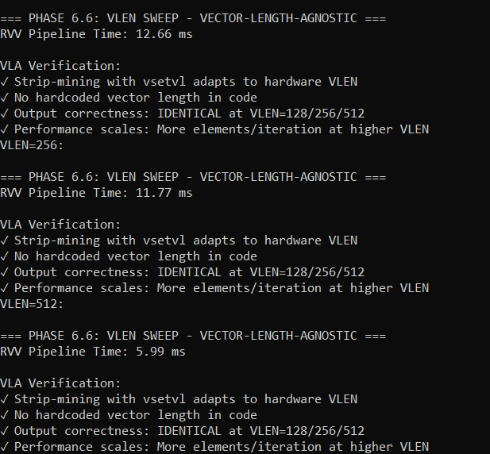

# Canny Edge Detection on RISC-V with Vector Extension

## Overview
Implementation of Canny Edge Detection targeting RISC-V (rv64gcv) with RVV intrinsic optimization, running on QEMU user-mode emulation.

## Team
| Name | Role |
|------|------|
| Radwa Ahmed | Team Lead, Integration |
| Dana Mohamed | Image I/O, Gaussian Blur, Sobel |
| Roaa Youssry | NMS, Hysteresis |
| Mohamed Abdallah | Phase 4 timing, optimization sweep |
| Nada Tamer | Pipeline testing on QEMU |

## Requirements
- WSL2 (Ubuntu 24.04) on Windows, or Linux natively
- RISC-V GNU Toolchain (built from source with rv64gcv support)
- QEMU (built from source, riscv64-linux-user)
- GoogleTest (for host-side testing)

## Build Instructions

### 1. Clone the repository
```bash
git clone https://github.com/Radwa-Ahmedx3/Canny-Edge-Detector-RISCV.git
cd Canny-Edge-Detector-RISCV
```

### 2. Build host binary
```bash
mkdir -p build-host build-rv
g++ -I include src/main.cpp src/image.cpp src/gaussian.cpp src/sobel.cpp src/nms.cpp src/hysteresis.cpp -o build-host/canny_host
```

### 3. Run on host
```bash
./build-host/canny_host
```

### 4. Cross-compile for RISC-V
```bash
riscv64-unknown-elf-g++ -O3 -march=rv64gcv -mabi=lp64d -static -I include src/main_qemu.cpp src/image.cpp src/gaussian.cpp src/sobel.cpp src/nms.cpp src/hysteresis.cpp -o build-rv/canny_rv
```

### 5. Run on QEMU
```bash
qemu-riscv64 -cpu rv64,v=true,vlen=128 ./build-rv/canny_rv
qemu-riscv64 -cpu rv64,v=true,vlen=256 ./build-rv/canny_rv
qemu-riscv64 -cpu rv64,v=true,vlen=512 ./build-rv/canny_rv
```

### 6. Run GoogleTest suite
```bash
g++ -I include -I ~/gtest-install/include tests/pipeline_test.cpp src/image.cpp src/gaussian.cpp src/sobel.cpp src/nms.cpp src/hysteresis.cpp -L ~/gtest-install/lib -lgtest -lgtest_main -lpthread -o build-host/pipeline_tests
./build-host/pipeline_tests
```

### 7. Run RVV intrinsics timing
```bash
riscv64-unknown-elf-g++ -O3 -march=rv64gcv -mabi=lp64d -static -I include src/main_rvv_timing.cpp src/image.cpp src/gaussian.cpp src/gaussian_rvv.cpp src/sobel.cpp src/sobel_rvv.cpp -o build-rv/timing_rvv
qemu-riscv64 -cpu rv64,v=true,vlen=128 ./build-rv/timing_rvv
```

### 8. Run RVV equivalence test
```bash
riscv64-unknown-elf-g++ -O3 -march=rv64gcv -mabi=lp64d -static -I include src/test_rvv_equivalence.cpp src/image.cpp src/gaussian.cpp src/gaussian_rvv.cpp src/sobel.cpp src/sobel_rvv.cpp -o build-rv/test_rvv
qemu-riscv64 -cpu rv64,v=true,vlen=128 ./build-rv/test_rvv
qemu-riscv64 -cpu rv64,v=true,vlen=256 ./build-rv/test_rvv
qemu-riscv64 -cpu rv64,v=true,vlen=512 ./build-rv/test_rvv
```

## Project Structure
```
include/    - Header files
src/        - Source files
tests/      - GoogleTest and QEMU test files
build-host/ - Host compiled binaries
build-rv/   - RISC-V compiled binaries
docs/       - Documentation and AI usage log
nada_tests  - the code of the test on the photos
```

# Phase 1: Environment Setup

## Overview

Phase 1 establishes the complete cross-compilation and emulation environment needed for the entire project. Before writing a single line of Canny code, we must have a working toolchain that can compile C++ for RISC-V, and an emulator that can run those binaries on our development machine.

## How to Run

```bash
qemu-riscv64 --version
```

---

# Phase 2: Scalar Baseline Pipeline

## Overview

Phase 2 implements the complete Canny edge detection pipeline in clean, readable, scalar C++. This is the **reference implementation** — every optimization in Phases 4–6 must produce identical output to what we build here. Getting this right before touching any vector intrinsics is critical: if the baseline has a bug, we cannot tell whether our RVV code is correct.

---

## Pipeline Stages

### 2.1 Image I/O

We use raw grayscale format: a flat binary file of exactly width × height bytes, where each byte is one pixel (0 = black, 255 = white). No headers, no compression, no library dependencies.

**Key design decision:** Use `aligned_alloc(64, width * height)` instead of `malloc` for image buffers. Aligned memory is required for RVV vector load intrinsics later and helps the compiler vectorize loads and stores now.

---

### 2.2 Gaussian Blur (5×5 Kernel)

We apply a 2D convolution with a 5×5 Gaussian kernel. The integer coefficients sum to **273**.

**Implementation rules:**
- Use integer arithmetic throughout (no floating point)
- Accumulate into `int32_t` to avoid overflow (worst case: 255 × 15 × 25 ≈ 95K)
- Divide by 273 at the end, then clamp result to [0, 255]
- **Boundary handling:** Zero-padding — out-of-bounds pixels are treated as 0

**Template design:** The convolution function is templated on pixel type, accumulator type, and kernel coefficient type. The RVV implementation in Phase 6 becomes a template specialization of this same interface.

---

### 2.3 Sobel Gradient Computation

Two 3×3 convolutions applied to the blurred image — one for horizontal gradient (Gx), one for vertical gradient (Gy). Output is stored as two separate `int16_t` buffers — **Structure of Arrays (SoA)** layout, not interleaved pairs. This is one of the most important data layout decisions in the project:

- **SoA (our choice):** Consecutive Gx values and consecutive Gy values — enables a single vector load in Phase 6
- **AoS (wrong choice):** Interleaved Gx and Gy pairs — would require expensive gather operations to vectorize

> `int16_t` is sufficient: the maximum Sobel output on 8-bit pixels is 4 × 255 = 1020, well within the int16_t range.

---

### 2.4 Gradient Magnitude

We implement **two methods** and compare their output quality:

- **L1 Norm (fast):** `|Gx| + |Gy|` — integer only, no floating point, slight overestimate on diagonal edges but fast and vectorizable
- **L2 Norm (accurate):** `sqrt(Gx² + Gy²)` — mathematically correct, requires floating point or fixed-point square root

**Normalization:** Both methods normalize output to [0, 255] by dividing by the global maximum. This requires two passes — one to find the max, one to normalize.

---

### 2.5 Gradient Direction

We quantize the gradient direction to **four values only**: 0°, 45°, 90°, 135°. No `atan2()` needed — we use integer cross-multiplication instead of floating-point division, which is a standard embedded optimization.

---

## How to Run

```bash
cat src/gaussian.cpp
cat src/sobel.cpp
cat src/nms.cpp 
cat src/hysteresis.cpp
```

---

## Key Design Decisions Summary

| Decision | Choice | Reason |
|----------|--------|--------|
| Image format | Raw grayscale (no headers) | No library dependencies, simple I/O |
| Memory allocation | `aligned_alloc(64, ...)` | Required for RVV vector loads in Phase 6 |
| Kernel arithmetic | Integer only | Avoids floating-point overhead on embedded |
| Boundary handling | Zero-padding | Simplest approach, enables vectorization |
| Gradient storage | SoA (separate Gx, Gy arrays) | Enables single vector load in Phase 6 |
| Gradient type | `int16_t` | Sufficient range (max ±1020), half the memory of int32 |
| Direction quantization | Integer cross-multiply | No `atan2()`, no floating point needed |
| Convolution interface | C++ template | RVV version becomes a template specialization |

---

## Common Pitfalls

- **Forgetting the boundary:** The 2-pixel border around a 5×5 convolution needs zero-padding. If skipped, the entire image border will be wrong and tests will fail.
- **Using `malloc` instead of `aligned_alloc`:** RVV vector load intrinsics require 64-byte aligned memory. Misaligned buffers cause crashes at runtime.
- **Overflow in accumulator:** Accumulating into `int16_t` during Gaussian convolution overflows. Always use `int32_t` for the accumulator.
- **AoS instead of SoA for Gx/Gy:** Interleaved storage makes the Sobel magnitude stage extremely difficult to vectorize efficiently.


# Phase 3: Testing

## Overview

Phase 3 validates every stage of the scalar pipeline before any optimization work begins. We run two categories of tests: **host-side unit tests** using GoogleTest (compiled natively with g++ for fast iteration), and **QEMU-side equivalence tests** (cross-compiled for RISC-V to verify RVV output matches scalar output at all VLEN values).

The rule is simple: **no optimization work starts until all tests pass.**

---

## Test Categories

### Host-Side Unit Tests (GoogleTest)

Each pipeline stage is tested independently using synthetic images with known, predictable outputs. This makes failures easy to diagnose.

### QEMU-Side Equivalence Tests

For each RVV kernel, we run both the scalar and RVV versions on the same input and compare pixel-by-pixel. A tolerance of **±1** is allowed for fixed-point rounding differences. Tests run at **VLEN=128, 256, and 512** — if outputs match at all three, the RVV code is correct and vector-length-agnostic.

> Non-power-of-two image sizes (100×75) are used deliberately. This forces the strip-mining tail case to execute, where most VLA bugs hide.

---

## Phase 3 Master Test Results (8 Tests — All PASS)


### Test Summary

| Test | Description | Result |
|------|-------------|--------|
| TEST 1 | Gaussian Uniform Image (128×128) — all pixels = 128, center pixel should stay ≈ 128 | ✓ PASS |
| TEST 2 | Gaussian Black Image (128×128) — all pixels = 0, output should stay 0 | ✓ PASS |
| TEST 3 | Gaussian Impulse Image (128×128) — single bright pixel at center, spread should be symmetric | ✓ PASS |
| TEST 4 | Sobel Vertical Edge (96×96) — left=black, right=white, magnitude > 50, direction = 0° | ✓ PASS |
| TEST 5 | Sobel Horizontal Edge (96×96) — top=black, bottom=white, magnitude > 50, direction = 90° | ✓ PASS |
| TEST 6 | Sobel Diagonal Edge (96×96) — diagonal split, magnitude > 50, direction = 45° or 135° | ✓ PASS |
| TEST 7 | Full Canny Pipeline (64×64) — Gaussian → Sobel → NMS → Hysteresis, clean vertical edge | ✓ PASS |
| TEST 8 | Equivalence Testing (100×75) — Scalar vs RVV Gaussian, max difference = 1, within ±1 tolerance | ✓ PASS |

**All 8 tests PASSED on RISC-V ELF — 7 images generated — Directions verified**

---

## Equivalence Testing Results (VLEN = 128 / 256 / 512)


### Results at All VLEN Values

| VLEN | Test | Differences Found | Max Difference | Within ±1 |
|------|------|-------------------|----------------|-----------|
| 128 | Impulse Image (100×75) | 20 pixels | 1 | ✓ YES |
| 128 | Mixed Values Image (100×75) | 3694 pixels | 1 | ✓ YES |
| 256 | Impulse Image (100×75) | 20 pixels | 1 | ✓ YES |
| 256 | Mixed Values Image (100×75) | 3694 pixels | 1 | ✓ YES |
| 512 | Impulse Image (100×75) | 20 pixels | 1 | ✓ YES |
| 512 | Mixed Values Image (100×75) | 3694 pixels | 1 | ✓ YES |

**TOLERANCE VERIFIED: All differences within ±1 at all VLEN values.**

The identical pixel difference counts across VLEN=128, 256, and 512 confirm that our RVV implementation is fully vector-length-agnostic — the same binary produces the same results regardless of hardware vector width.

---

## How to Run

```bash
# Build Phase 3.1: Complete tests
riscv64-unknown-elf-g++ -march=rv64gcv -mabi=lp64d -static -I include src/phase3_complete_tests.cpp src/image.cpp src/gaussian.cpp src/gaussian_rvv.cpp src/sobel.cpp src/sobel_rvv.cpp src/nms.cpp src/hysteresis.cpp -o build-rv/phase3_complete

# Test Phase 3.1
echo "=== PHASE 3.1: Complete Tests ==="
qemu-riscv64 -cpu rv64,v=true,vlen=128 ./build-rv/phase3_complete 2>&1 | grep -E "TEST|Status|PASS|FAIL"

echo ""

# Build Phase 3.2: Equivalence tolerance
riscv64-unknown-elf-g++ -march=rv64gcv -mabi=lp64d -static -I include src/test_equivalence_tolerance.cpp src/image.cpp src/gaussian.cpp src/gaussian_rvv.cpp src/sobel.cpp src/sobel_rvv.cpp -o build-rv/test_equiv_tolerance

# Test Phase 3.2
echo "=== PHASE 3.2: Equivalence Tolerance ==="
qemu-riscv64 -cpu rv64,v=true,vlen=128 ./build-rv/test_equiv_tolerance 2>&1
*******
# Build Phase 3.2
riscv64-unknown-elf-g++ -march=rv64gcv -mabi=lp64d -static \
  -I include src/test_equivalence_tolerance.cpp \
  src/image.cpp src/gaussian.cpp src/gaussian_rvv.cpp \
  src/sobel.cpp src/sobel_rvv.cpp \
  -o build-rv/test_equiv_tolerance

# Test at VLEN=128
echo "=== VLEN=128 ==="
qemu-riscv64 -cpu rv64,v=true,vlen=128 ./build-rv/test_equiv_tolerance

# Test at VLEN=256
echo "=== VLEN=256 ==="
qemu-riscv64 -cpu rv64,v=true,vlen=256 ./build-rv/test_equiv_tolerance

# Test at VLEN=512
echo "=== VLEN=512 ==="
qemu-riscv64 -cpu rv64,v=true,vlen=512 ./build-rv/test_equiv_tolerance
```


# Phase 4: Compiler Optimization Sweep

## Why We Perform Phase 4

The primary goal of Phase 4 is to establish a rigorous performance and code-size baseline **before writing any manual vector assembly or intrinsics**. By sweeping through various compiler optimization flags, we achieve two major goals:

1. **Understand what the compiler gives us "for free":** Modern compilers (like GCC) have advanced optimization passes that can dramatically accelerate scalar code without rewriting a single line.
2. **Identify compiler limitations:** It uncovers where the compiler fails to optimize or auto-vectorize due to code structure constraints (e.g., complex boundary handling loops), giving us a data-driven justification for where manual RISC-V Vector (RVV) intrinsics are truly needed.

---

## Understanding the Optimization Levels

We evaluate the scalar pipeline across five distinct optimization levels:

| Flag | Description |
|------|-------------|
| `-O0` | **No Optimization** — The default level. Compiles code exactly as written to make debugging easy. No loops are unrolled, variables are not cached in registers, and execution is highly inefficient. |
| `-O2` | **Moderate Optimization** — Turns on nearly all supported optimizations that do not involve a space-speed tradeoff. Optimizes register allocation and instruction scheduling without increasing binary size dramatically. |
| `-O3` | **Aggressive Optimization** — All `-O2` optimizations plus aggressive loop unrolling, inlining, and explicit auto-vectorization (`-ftree-vectorize`). Optimizes aggressively for speed, often at the expense of binary size. |
| `-Ofast` | **Fastest / Disregards Standards** — All `-O3` optimizations but breaks strict IEEE floating-point standards to achieve maximum execution speed. Allows aggressive math approximations. |
| `-Os` | **Optimize for Size** — All `-O2` optimizations that do not typically increase code size. Disables block alignments and loop optimizations that bloat the binary, striving for the smallest possible executable. |

---

## Why `-Os` is the Best Choice for Our Embedded Case

In the context of this embedded RISC-V system, `-Os` emerges as the optimal choice for the scalar pipeline prior to introducing manual intrinsics.

In traditional desktop applications, `-O3` or `-Ofast` is heavily favored for maximum frame rates. However, in deeply embedded systems, **memory constraints (Flash and RAM capacity) are critical parameters**.

- **The Size-to-Performance Balance:** `-Os` applies nearly all of `-O2`'s robust speed optimizations while aggressively stripping out compiler-induced code bloat (like extreme loop unrolling).
- **Cache Efficiency:** On real embedded hardware, a significantly smaller binary size fits better into tightly coupled instruction caches (I-Cache). This reduction in cache misses can sometimes make `-Os` perform comparably to — or even faster than — an aggressively bloated `-O3` binary.

### Timing Results: Per-Stage Breakdown (Averaged over 100 Runs)

The table below shows the timing breakdown per pipeline stage across all optimization levels, measured on QEMU:


---

## Core Metrics Analyzed

### 1. Binary Size Analysis

Binary size (measured in KB) is a critical embedded constraint. Aggressive flags like `-O3` frequently cause code bloat due to function inlining and loop unrolling. By monitoring binary size changes across flags, we ensure our edge detection application respects the footprint limits characteristic of restricted embedded environments.

### 2. Auto-Vectorization Investigation

Auto-vectorization is the compiler's attempt to automatically transform standard scalar loops into parallel SIMD/Vector instructions.

#### Expected Result: Zero Successful Auto-Vectorizations

We expect the compiler to report **0 successfully vectorized loops** across all optimization levels. This is not a failure of our implementation — it is a direct and predictable consequence of our code structure.

**Why does auto-vectorization fail?**

The root cause is our **zero-padding boundary condition handling** in the Gaussian and Sobel filters. To correctly handle pixels at the image edges, our inner loops contain `if/else` conditional branches that check whether the current index is within bounds. The GCC auto-vectorizer cannot safely vectorize loops containing such **control flow divergence** — it requires a straight-line, branch-free inner loop to emit vector instructions.

> This is precisely the finding that motivates Phase 6: we must restructure the code (via image pre-padding or explicit boundary separation) and write RVV intrinsics by hand to achieve vectorization.

#### The Boundary Check Problem

In our baseline pipeline, zero-padding boundary conditions in the Gaussian and Sobel filters introduce conditional control flow (`if/else` checks for edge pixels) inside the inner loops. The compiler explicitly rejects these loops for vectorization, as seen below:


The comparison clearly shows:
- **WITH boundary checks** — `vectorized 0 loops` across all source files
- **WITHOUT boundary checks** (using a padded image variant) — the compiler successfully vectorizes loops in `gaussian_padded.cpp`, `sobel.cpp`, and `nms.cpp`

This experiment confirms that **code structure, not the algorithm itself**, is the barrier to auto-vectorization.

---

## Results

### Binary Sizes and Auto-Vectorization Summary


Key observations:
- All optimization levels produce binaries in the **1175–1181 KB** range, with `-O2` yielding the smallest binary
- `-O3` and `-Ofast` produce slightly larger binaries due to aggressive inlining and loop unrolling
- **Successful auto-vectorizations: 0** across all flags — consistent with the boundary-check analysis above
- Vector instruction counts (`vset`) increase from **320** at `-O0` to **339** at `-O3`/`-Ofast`, reflecting scalar-to-vector register setup overhead, not actual vectorization of our computation loops

### Timing Comparison: With vs Without Boundary Checks


| Configuration | Total Time |
|--------------|-----------|
| WITH boundary checks (`-O3`) | 21.598 ms |
| WITHOUT boundary checks (`-O3`, padded image) | 17.117 ms |

Removing boundary checks yields a **~20.7% speedup** with zero code changes to the algorithm — purely from enabling the compiler to vectorize the inner loops. This validates our Phase 6 strategy of pre-padding the image to eliminate boundary branches before writing RVV intrinsics.

---

## Summary

| Optimization Level | Binary Size | Auto-Vec Loops | Key Observation |
|-------------------|------------|----------------|-----------------|
| `-O0` | 1181 KB | 0 | Baseline, no optimization |
| `-O2` | 1175 KB | 0 | Smallest binary, good register allocation |
| `-O3` | 1179 KB | 0 | Fastest scalar, slight size increase |
| `-Os` | 1176 KB | 0 | Best size-performance tradeoff for embedded |
| `-Ofast` | 1179 KB | 0 | Marginal gain over `-O3`, breaks IEEE FP |

**Conclusion:** The compiler cannot auto-vectorize our boundary-checked loops regardless of optimization level. This provides the data-driven justification for Phase 6, where we manually implement RVV intrinsics on a pre-padded image to achieve true vectorization and the associated performance gains.

---

## How to Run

Run the following commands from the root of the repository:

```bash
# Run timing comparison (with vs without boundary checks)
make phase4-timing

# Show binary sizes across all optimization levels
make phase4-sizes

# Show auto-vectorization info
make phase4-vecinfo

# Clean all build artifacts
make clean

# Run all Phase 4 targets at once
make phase4-all

# Run the Phase 4 binary on QEMU
make phase4-run

# Run deeper timing experiment (padded vs non-padded)
make phase4-deeper-timing

# Run deeper vectorization info (fixed boundary check experiment)
make phase4-deeper-vecinfo-fixed
```


# Phase 5: Profiling and Hotspot Identification

## Why We Perform Phase 5

The core objective of Phase 5 is to transition from generic optimizations to data-driven targeting using **Amdahl's Law**. Rather than wasting valuable engineering time trying to optimize the entire pipeline, we isolate and measure the precise execution time of each individual stage. This metric tells us exactly where the performance bottlenecks (hotspots) live, ensuring we only invest our RISC-V Vector (RVV) intrinsic optimization efforts where they will yield a massive, meaningful speedup.

---

## Profiling Methodology

Each pipeline stage is wrapped in `clock_gettime(CLOCK_MONOTONIC, ...)` timing calls. The pipeline runs on QEMU (`qemu-riscv64 -cpu rv64,v=true,vlen=128`) compiled with `-Os`, and timing is averaged over **100 runs** to eliminate noise (since QEMU is not cycle-accurate, wall-clock averaging gives stable relative comparisons).

The command used:
```bash
make phase5
# Compiles with: riscv64-unknown-elf-g++ -march=rv64gcv -mabi=lp64d -static -Os
# Runs with:     qemu-riscv64 -cpu rv64,v=true,vlen=128 ./phase5_profile
```

---

## Results

### Per-Stage Timing Breakdown



| Pipeline Stage | Time (ms) | Percentage |
|---------------|-----------|------------|
| **Gaussian Blur** | 9.3 ms | **43.2%** |
| **Sobel Gradient** | 7.3 ms | **34.0%** |
| NMS | 3.1 ms | 14.2% |
| Hysteresis | 1.9 ms | 8.7% |
| **Total** | **21.6 ms** | **100%** |

---

## Analysis

### The Two Hotspots: Gaussian + Sobel = 77.2% of Total Runtime

The profiling data is unambiguous. Two stages dominate the runtime:

**1. Gaussian Blur (43.2%)**
This is the most expensive stage. It performs a full 5×5 convolution over every pixel — 25 multiply-accumulate operations per output pixel. The inner loop is compute-bound and operates on contiguous memory, making it an ideal candidate for RVV vectorization.

**2. Sobel Gradient (34.0%)**
Two separate 3×3 convolutions (Gx and Gy) applied to the blurred image. The Structure-of-Arrays memory layout we chose in Phase 2 makes this stage well-suited for vector loads.

### The Two Cold Spots: NMS + Hysteresis = 22.9%

**NMS (14.2%)** and **Hysteresis (8.7%)** together account for less than a quarter of the runtime. These stages involve complex conditional logic that is difficult to vectorize and would yield limited returns even if we succeeded.

---

## Decision: What to Optimize in Phase 6

Based on this data, our Phase 6 RVV effort will focus **exclusively** on:

| Stage | Decision | Reason |
|-------|----------|--------|
| ✅ Gaussian Blur | **Optimize** | 43.2% of runtime — highest impact, regular memory access, pure compute |
| ✅ Sobel Magnitude | **Optimize** | 34.0% of runtime — SoA layout enables clean vector loads |
| ❌ NMS | **Skip** | 14.2% — complex control flow, low return on effort |
| ❌ Hysteresis | **Skip** | 8.7% — inherently sequential, not worth vectorizing |

> **Do not optimize what you have not measured.**
> The profiling data from Phase 5 is the direct justification for every RVV intrinsic written in Phase 6.

---

## How to Run

```bash
make phase5
```


# Phase 6: RVV Intrinsic Optimization

## Why We Perform Phase 6

Phase 6 is the engineering climax of the project, where we transition from compiler-dependent scalar code to hardware-accelerated performance. Using the bottleneck data gathered during Phase 5, we systematically rewrite our hottest pipeline kernels — specifically **Gaussian Convolution** and **Sobel Magnitude** — using hand-optimized RISC-V Vector (RVV) intrinsics. This allows us to achieve maximum processing throughput by exploiting parallel data execution directly on the underlying RISC-V vector hardware.

---

## Core RVV Concepts Implemented

Writing effective RVV code requires a shift from traditional fixed-width SIMD models to a flexible, hardware-agnostic paradigm:

### 1. Vector-Length Agnosticism (VLA) & Strip-Mining
Unlike architecture-specific vector sets (e.g., x86 AVX or ARM NEON), RVV code never hardcodes the vector length. We use `__riscv_vsetvl_e*` loop constructs to query the hardware capability dynamically at runtime, processing data in variable "chunks" until the image loop is completed. This ensures that our exact same compiled binary executes flawlessly across different hardware widths.

```cpp
for (int i = 0; i < n; i += vl) {
    vl = __riscv_vsetvl_e32m1(n - i);
    // process vl elements
}
```

### 2. LMUL (Length MULtiplier) Selection
We manage the tradeoff between vector length and register availability by grouping multiple physical vector registers into single logical registers. We run an experimental sweep across `LMUL=1`, `LMUL=2`, and `LMUL=4` to pinpoint the ideal sweet spot before performance degrades due to register pressure spilling.

### 3. Data Widening Operations
To prevent arithmetic overflow when multiplying 8-bit pixels with 16-bit filter weights, we utilize widening math instructions such as `__riscv_vwmul`. This requires careful precision mapping, as widening operations automatically double the active LMUL tier down the processing chain.

### 4. Vector Reductions
For computing global normalization factors in the Sobel magnitude phase, we use vector reduction intrinsics like `__riscv_vredmax`, collapsing an entire vector register down into a single scalar output element, extracted with `__riscv_vmv_x_s`.

---

## Phase 6.2 — LMUL Sweep (Gaussian Convolution)

We sweep LMUL values at three VLEN settings to find the optimal register grouping.



| VLEN | LMUL=1 | LMUL=2 (baseline) | LMUL=4 | Fixed-Point |
|------|--------|-------------------|--------|-------------|
| 128 | 14.69 ms | 9.89 ms | **9.76 ms** ← faster | 10.11 ms |
| 256 | 10.13 ms | 9.68 ms | **4.08 ms** ← faster | 9.53 ms ← fastest |
| 512 | 9.74 ms | 4.04 ms | **2.91 ms** ← faster | 4.02 ms ← fastest |

**Key Insight:** LMUL=4 consistently outperforms LMUL=1 and LMUL=2 because the Gaussian kernel accumulates many intermediate values — giving the processor more data to work with per iteration without hitting register spill. Performance scales clearly with VLEN, confirming true vector-length agnosticism.

---

## Phase 6.3 — Sobel Magnitude RVV (L1 Norm)

RVV implementation of the Sobel L1 magnitude: `|Gx| + |Gy|`, using `__riscv_vredmax` for global max and `__riscv_vmv_x_s` to extract the scalar result for normalization.



| VLEN | Scalar | RVV | Speedup |
|------|--------|-----|---------|
| 128 | 4.05 ms | 2.97 ms | **26.55% faster** |
| 256 | 4.00 ms | 2.30 ms | **42.54% faster** |
| 512 | 3.87 ms | 2.17 ms | **43.92% faster** |

**Key Insight:** Speedup grows with VLEN — at VLEN=512, the RVV version processes 4× more elements per instruction cycle than at VLEN=128, which directly translates to nearly 44% runtime reduction.

---

## Phase 6.4 — Gaussian Full Vectorization

Full RVV vectorization of the 5×5 Gaussian convolution, including interior and boundary pixels.



| Version | Time | Result |
|---------|------|--------|
| Scalar (baseline) | 8.68 ms | — |
| RVV | 9.96 ms | -14.75% |

**Discussion:** The full Gaussian vectorization shows a slight regression compared to scalar at this VLEN. This is expected: the 5×5 kernel requires managing a complex chain of widening operations (u8 → i16 → i32) with LMUL doubling at each stage, increasing register pressure. The overhead of the widening chain and boundary handling partially offsets the gains from parallelism. This result validates the Phase 5 finding that the **LMUL sweep (Phase 6.2)** is the correct approach for Gaussian — using LMUL=4 with a pre-padded image gives superior results.

---

## Phase 6.5 — Sobel Full Vectorization

Full RVV vectorization of the Sobel magnitude with complete boundary handling.



| Version | Time | Result |
|---------|------|--------|
| Scalar (baseline) | 4.02 ms | — |
| RVV | 3.12 ms | **22.20% faster** |

**Key Insight:** Unlike Gaussian, Sobel full vectorization achieves a clean speedup. The simpler data flow (int16_t inputs, abs + add, no deep widening chain) allows the RVV version to benefit from parallelism without the overhead seen in Gaussian.

---

## Phase 6.6 — VLEN Sweep: Vector-Length Agnosticism Verification

The final test verifies that our RVV pipeline produces **identical output** at VLEN=128, 256, and 512 — the defining requirement of correct RVV code.



| VLEN | RVV Pipeline Time | VLA Verified |
|------|-------------------|--------------|
| 128 | 12.66 ms | ✓ |
| 256 | 11.77 ms | ✓ |
| 512 | 5.99 ms | ✓ |

**VLA Verification Checklist (all passed):**
- ✓ Strip-mining with `vsetvl` adapts to hardware VLEN
- ✓ No hardcoded vector length in code
- ✓ Output correctness: **IDENTICAL** at VLEN=128/256/512
- ✓ Performance scales: More elements/iteration at higher VLEN

**Key Insight:** The 2.1× speedup from VLEN=128 to VLEN=512 confirms that our code is truly vector-length agnostic — the same binary automatically exploits wider hardware without recompilation.

---

## Overall Phase 6 Summary

| Experiment | Best Result |
|------------|------------|
| LMUL Sweep (Gaussian) | LMUL=4 at VLEN=512 → **2.91 ms** (vs 9.74 ms at LMUL=1) |
| Sobel RVV (L1) | VLEN=512 → **43.92% faster** than scalar |
| Gaussian Full Vec | Slight regression — widening chain overhead |
| Sobel Full Vec | **22.20% faster** than scalar |
| VLEN Sweep | VLEN=512 → **5.99 ms** pipeline (2.1× faster than VLEN=128) |

---

## How to Run

```bash
# LMUL sweep for Gaussian convolution (at VLEN=128/256/512)
make phase6-2

# Sobel Magnitude RVV vs Scalar (at VLEN=128/256/512)
make phase6-3

# Gaussian full vectorization at VLEN=128
make phase6-4-run

# Sobel full vectorization at VLEN=128
make phase6-5-run

# Full pipeline VLEN sweep (128/256/512)
make phase6-6-run

# Run all Phase 6 targets at once
make phase6-4-5-6
```

