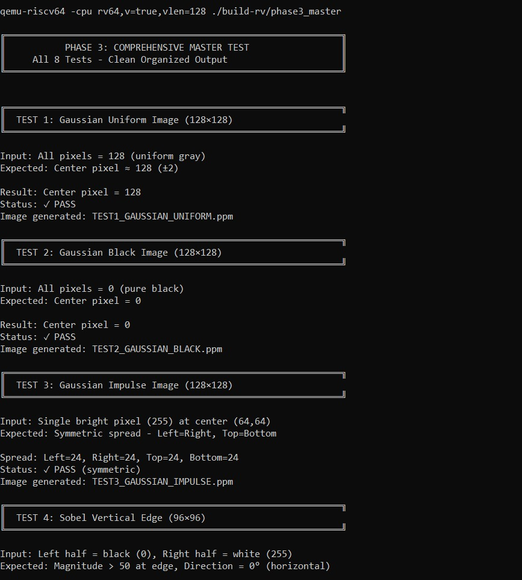
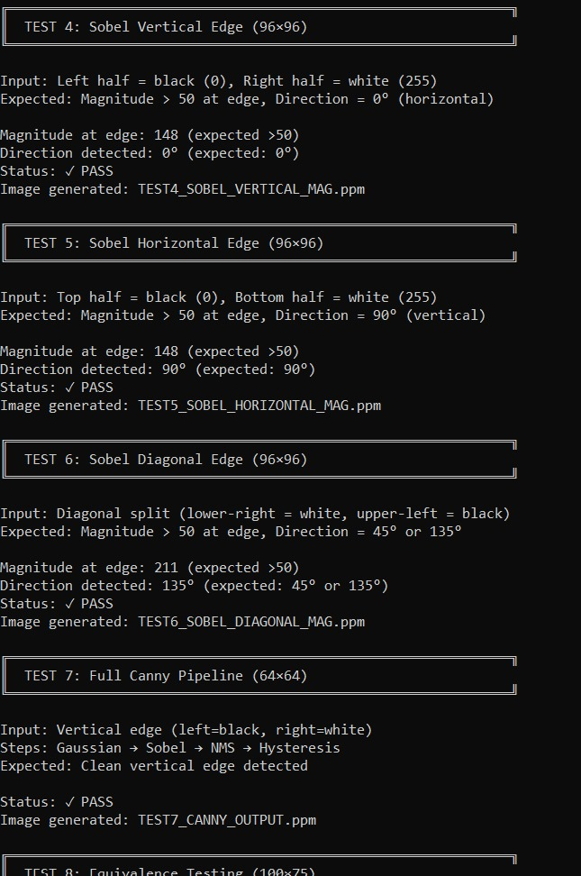
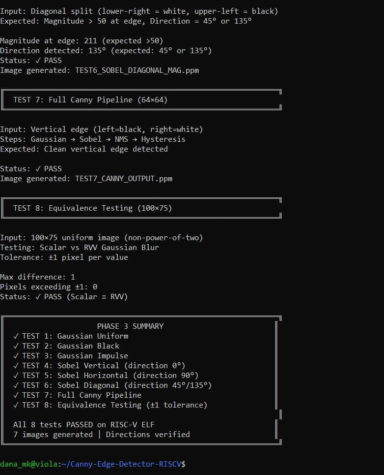
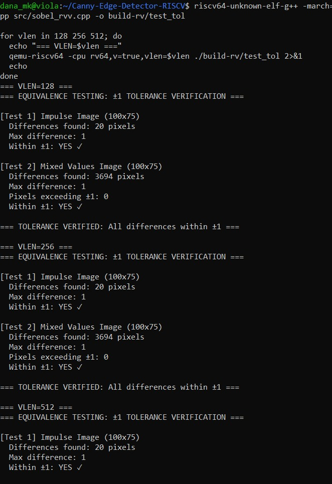
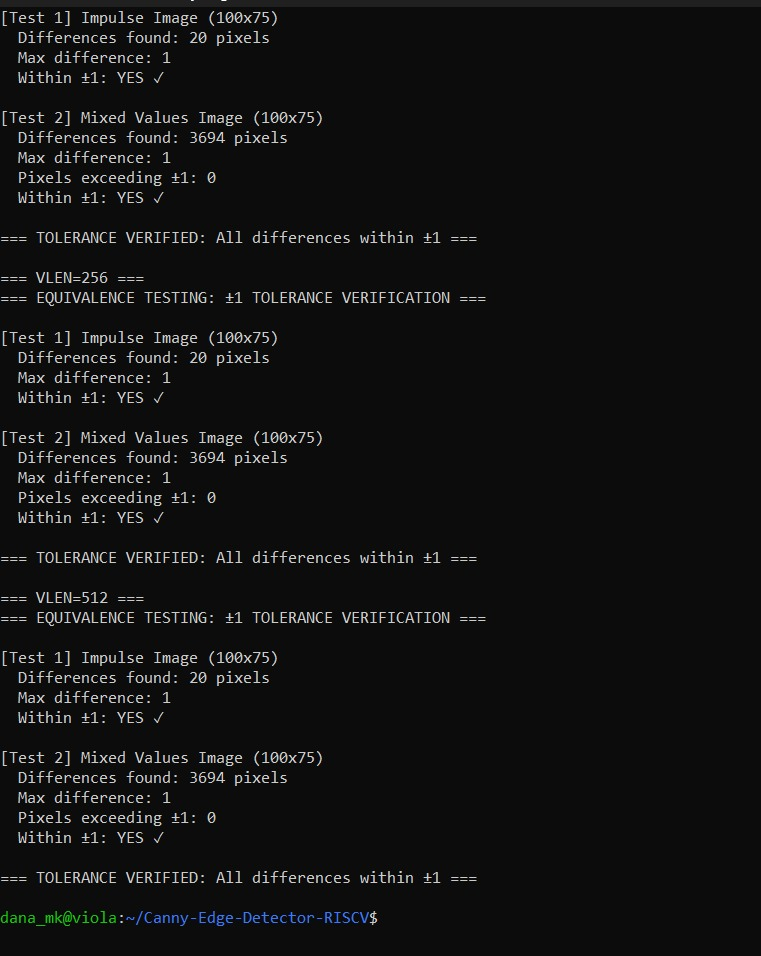

# Phase 3: Testing

## Overview

Phase 3 validates every stage of the scalar pipeline before any optimization work begins. We run two categories of tests: **host-side unit tests** using GoogleTest (compiled natively with g++ for fast iteration), and **QEMU-side equivalence tests** (cross-compiled for RISC-V to verify RVV output matches scalar output at all VLEN values).

The rule is simple: **no optimization work starts until all tests pass.**

---

## Test Categories

### Host-Side Unit Tests (GoogleTest)

Each pipeline stage is tested independently using synthetic images with known, predictable outputs. This makes failures easy to diagnose.

### QEMU-Side Equivalence Tests

For each RVV kernel, we run both the scalar and RVV versions on the same input and compare pixel-by-pixel. A tolerance of **±1** is allowed for fixed-point rounding differences. Tests run at **VLEN=128, 256, and 512** — if outputs match at all three, the RVV code is correct and vector-length-agnostic.

> Non-power-of-two image sizes (100×75) are used deliberately. This forces the strip-mining tail case to execute, where most VLA bugs hide.

---

## Phase 3 Master Test Results (8 Tests — All PASS)







### Test Summary

| Test | Description | Result |
|------|-------------|--------|
| TEST 1 | Gaussian Uniform Image (128×128) — all pixels = 128, center pixel should stay ≈ 128 | ✓ PASS |
| TEST 2 | Gaussian Black Image (128×128) — all pixels = 0, output should stay 0 | ✓ PASS |
| TEST 3 | Gaussian Impulse Image (128×128) — single bright pixel at center, spread should be symmetric | ✓ PASS |
| TEST 4 | Sobel Vertical Edge (96×96) — left=black, right=white, magnitude > 50, direction = 0° | ✓ PASS |
| TEST 5 | Sobel Horizontal Edge (96×96) — top=black, bottom=white, magnitude > 50, direction = 90° | ✓ PASS |
| TEST 6 | Sobel Diagonal Edge (96×96) — diagonal split, magnitude > 50, direction = 45° or 135° | ✓ PASS |
| TEST 7 | Full Canny Pipeline (64×64) — Gaussian → Sobel → NMS → Hysteresis, clean vertical edge | ✓ PASS |
| TEST 8 | Equivalence Testing (100×75) — Scalar vs RVV Gaussian, max difference = 1, within ±1 tolerance | ✓ PASS |

**All 8 tests PASSED on RISC-V ELF — 7 images generated — Directions verified**

---

## Equivalence Testing Results (VLEN = 128 / 256 / 512)





### Results at All VLEN Values

| VLEN | Test | Differences Found | Max Difference | Within ±1 |
|------|------|-------------------|----------------|-----------|
| 128 | Impulse Image (100×75) | 20 pixels | 1 | ✓ YES |
| 128 | Mixed Values Image (100×75) | 3694 pixels | 1 | ✓ YES |
| 256 | Impulse Image (100×75) | 20 pixels | 1 | ✓ YES |
| 256 | Mixed Values Image (100×75) | 3694 pixels | 1 | ✓ YES |
| 512 | Impulse Image (100×75) | 20 pixels | 1 | ✓ YES |
| 512 | Mixed Values Image (100×75) | 3694 pixels | 1 | ✓ YES |

**TOLERANCE VERIFIED: All differences within ±1 at all VLEN values.**

The identical pixel difference counts across VLEN=128, 256, and 512 confirm that our RVV implementation is fully vector-length-agnostic — the same binary produces the same results regardless of hardware vector width.

---

## How to Run

```bash
# Run all Phase 3 tests
make phase3-all

# Convert generated .ppm output images to .png for viewing
convert input.ppm output.png

# Build Phase 3.1: Complete tests
riscv64-unknown-elf-g++ -march=rv64gcv -mabi=lp64d -static -I include src/phase3_complete_tests.cpp src/image.cpp src/gaussian.cpp src/gaussian_rvv.cpp src/sobel.cpp src/sobel_rvv.cpp src/nms.cpp src/hysteresis.cpp -o build-rv/phase3_complete

# Test Phase 3.1
echo "=== PHASE 3.1: Complete Tests ==="
qemu-riscv64 -cpu rv64,v=true,vlen=128 ./build-rv/phase3_complete 2>&1 | grep -E "TEST|Status|PASS|FAIL"

echo ""

# Build Phase 3.2: Equivalence tolerance
riscv64-unknown-elf-g++ -march=rv64gcv -mabi=lp64d -static -I include src/test_equivalence_tolerance.cpp src/image.cpp src/gaussian.cpp src/gaussian_rvv.cpp src/sobel.cpp src/sobel_rvv.cpp -o build-rv/test_equiv_tolerance

# Test Phase 3.2
echo "=== PHASE 3.2: Equivalence Tolerance ==="
qemu-riscv64 -cpu rv64,v=true,vlen=128 ./build-rv/test_equiv_tolerance 2>&1
*******
# Build Phase 3.2
riscv64-unknown-elf-g++ -march=rv64gcv -mabi=lp64d -static \
  -I include src/test_equivalence_tolerance.cpp \
  src/image.cpp src/gaussian.cpp src/gaussian_rvv.cpp \
  src/sobel.cpp src/sobel_rvv.cpp \
  -o build-rv/test_equiv_tolerance

# Test at VLEN=128
echo "=== VLEN=128 ==="
qemu-riscv64 -cpu rv64,v=true,vlen=128 ./build-rv/test_equiv_tolerance

# Test at VLEN=256
echo "=== VLEN=256 ==="
qemu-riscv64 -cpu rv64,v=true,vlen=256 ./build-rv/test_equiv_tolerance

# Test at VLEN=512
echo "=== VLEN=512 ==="
qemu-riscv64 -cpu rv64,v=true,vlen=512 ./build-rv/test_equiv_tolerance
```
