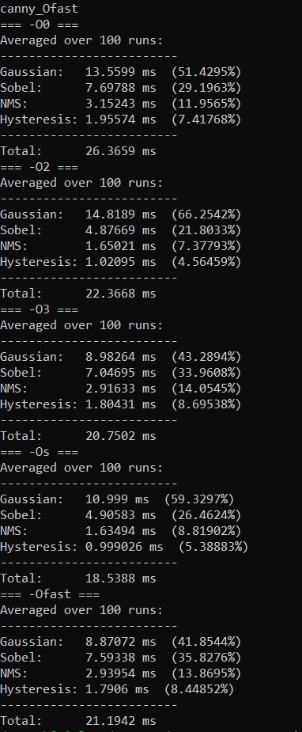
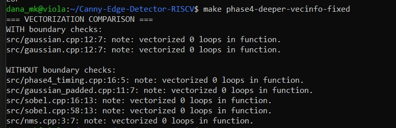
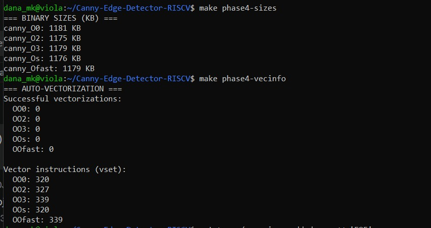
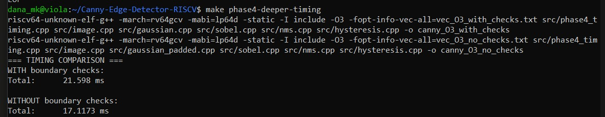

# Phase 4: Compiler Optimization Sweep

## Why We Perform Phase 4

The primary goal of Phase 4 is to establish a rigorous performance and code-size baseline **before writing any manual vector assembly or intrinsics**. By sweeping through various compiler optimization flags, we achieve two major goals:

1. **Understand what the compiler gives us "for free":** Modern compilers (like GCC) have advanced optimization passes that can dramatically accelerate scalar code without rewriting a single line.
2. **Identify compiler limitations:** It uncovers where the compiler fails to optimize or auto-vectorize due to code structure constraints (e.g., complex boundary handling loops), giving us a data-driven justification for where manual RISC-V Vector (RVV) intrinsics are truly needed.

---

## Understanding the Optimization Levels

We evaluate the scalar pipeline across five distinct optimization levels:

| Flag | Description |
|------|-------------|
| `-O0` | **No Optimization** — The default level. Compiles code exactly as written to make debugging easy. No loops are unrolled, variables are not cached in registers, and execution is highly inefficient. |
| `-O2` | **Moderate Optimization** — Turns on nearly all supported optimizations that do not involve a space-speed tradeoff. Optimizes register allocation and instruction scheduling without increasing binary size dramatically. |
| `-O3` | **Aggressive Optimization** — All `-O2` optimizations plus aggressive loop unrolling, inlining, and explicit auto-vectorization (`-ftree-vectorize`). Optimizes aggressively for speed, often at the expense of binary size. |
| `-Ofast` | **Fastest / Disregards Standards** — All `-O3` optimizations but breaks strict IEEE floating-point standards to achieve maximum execution speed. Allows aggressive math approximations. |
| `-Os` | **Optimize for Size** — All `-O2` optimizations that do not typically increase code size. Disables block alignments and loop optimizations that bloat the binary, striving for the smallest possible executable. |

---

## Why `-Os` is the Best Choice for Our Embedded Case

In the context of this embedded RISC-V system, `-Os` emerges as the optimal choice for the scalar pipeline prior to introducing manual intrinsics.

In traditional desktop applications, `-O3` or `-Ofast` is heavily favored for maximum frame rates. However, in deeply embedded systems, **memory constraints (Flash and RAM capacity) are critical parameters**.

- **The Size-to-Performance Balance:** `-Os` applies nearly all of `-O2`'s robust speed optimizations while aggressively stripping out compiler-induced code bloat (like extreme loop unrolling).
- **Cache Efficiency:** On real embedded hardware, a significantly smaller binary size fits better into tightly coupled instruction caches (I-Cache). This reduction in cache misses can sometimes make `-Os` perform comparably to — or even faster than — an aggressively bloated `-O3` binary.

### Timing Results: Per-Stage Breakdown (Averaged over 100 Runs)

The table below shows the timing breakdown per pipeline stage across all optimization levels, measured on QEMU:

---

## Core Metrics Analyzed

### 1. Binary Size Analysis

Binary size (measured in KB) is a critical embedded constraint. Aggressive flags like `-O3` frequently cause code bloat due to function inlining and loop unrolling. By monitoring binary size changes across flags, we ensure our edge detection application respects the footprint limits characteristic of restricted embedded environments.

### 2. Auto-Vectorization Investigation

Auto-vectorization is the compiler's attempt to automatically transform standard scalar loops into parallel SIMD/Vector instructions.

#### Expected Result: Zero Successful Auto-Vectorizations

We expect the compiler to report **0 successfully vectorized loops** across all optimization levels. This is not a failure of our implementation — it is a direct and predictable consequence of our code structure.

**Why does auto-vectorization fail?**

The root cause is our **zero-padding boundary condition handling** in the Gaussian and Sobel filters. To correctly handle pixels at the image edges, our inner loops contain `if/else` conditional branches that check whether the current index is within bounds. The GCC auto-vectorizer cannot safely vectorize loops containing such **control flow divergence** — it requires a straight-line, branch-free inner loop to emit vector instructions.

> This is precisely the finding that motivates Phase 6: we must restructure the code (via image pre-padding or explicit boundary separation) and write RVV intrinsics by hand to achieve vectorization.

#### The Boundary Check Problem

In our baseline pipeline, zero-padding boundary conditions in the Gaussian and Sobel filters introduce conditional control flow (`if/else` checks for edge pixels) inside the inner loops. The compiler explicitly rejects these loops for vectorization, as seen below:

The comparison clearly shows:
- **WITH boundary checks** — `vectorized 0 loops` across all source files
- **WITHOUT boundary checks** (using a padded image variant) — the compiler successfully vectorizes loops in `gaussian_padded.cpp`, `sobel.cpp`, and `nms.cpp`

This experiment confirms that **code structure, not the algorithm itself**, is the barrier to auto-vectorization.

---

## Results

### Binary Sizes and Auto-Vectorization Summary

Key observations:
- All optimization levels produce binaries in the **1175–1181 KB** range, with `-O2` yielding the smallest binary
- `-O3` and `-Ofast` produce slightly larger binaries due to aggressive inlining and loop unrolling
- **Successful auto-vectorizations: 0** across all flags — consistent with the boundary-check analysis above
- Vector instruction counts (`vset`) increase from **320** at `-O0` to **339** at `-O3`/`-Ofast`, reflecting scalar-to-vector register setup overhead, not actual vectorization of our computation loops

### Timing Comparison: With vs Without Boundary Checks

| Configuration | Total Time |
|--------------|-----------|
| WITH boundary checks (`-O3`) | 21.598 ms |
| WITHOUT boundary checks (`-O3`, padded image) | 17.117 ms |

Removing boundary checks yields a **~20.7% speedup** with zero code changes to the algorithm — purely from enabling the compiler to vectorize the inner loops. This validates our Phase 6 strategy of pre-padding the image to eliminate boundary branches before writing RVV intrinsics.

---

## Summary

| Optimization Level | Binary Size | Auto-Vec Loops | Key Observation |
|-------------------|------------|----------------|-----------------|
| `-O0` | 1181 KB | 0 | Baseline, no optimization |
| `-O2` | 1175 KB | 0 | Smallest binary, good register allocation |
| `-O3` | 1179 KB | 0 | Fastest scalar, slight size increase |
| `-Os` | 1176 KB | 0 | Best size-performance tradeoff for embedded |
| `-Ofast` | 1179 KB | 0 | Marginal gain over `-O3`, breaks IEEE FP |

**Conclusion:** The compiler cannot auto-vectorize our boundary-checked loops regardless of optimization level. This provides the data-driven justification for Phase 6, where we manually implement RVV intrinsics on a pre-padded image to achieve true vectorization and the associated performance gains.
